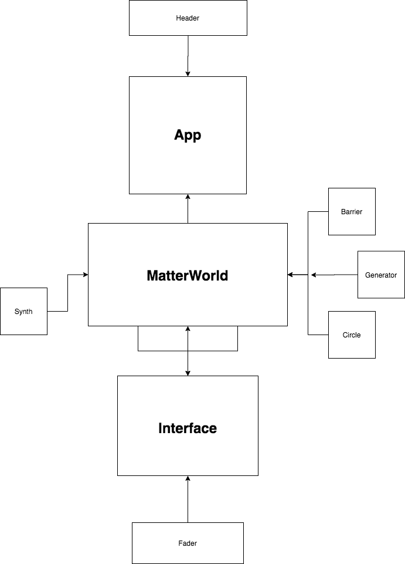

<br>
<p align="center">
  <u><big>|| <b>Gravitone | Epicodus Capstone 2020</b> ||</big></u>
</p>
<p align="center">
    <!-- Project Avatar/Logo -->
    <br>
    <a>
        
    </a>
    <a>
        
    </a>
    <p align="center">
      ___________________________
    </p>
    <!-- GitHub Link -->
    <p align="center">
        <a href="https://github.com/GrantEadie">
            <strong>GrantEadie</strong>
        </a> 
    </p>
</p>

<p align="center">
  <small>Initiated December 23rd, 2020</small>
</p>

---

### <u>Table of Contents</u>

- <a href="#🌐-about-the-project">About the Project</a>
  - <a href="#📖-description">Description</a>
  - <a href="#🦠-known-bugs">Known Bugs</a>
  - <a href="#🛠-built-with">Built With</a>
  <!-- * <a href="#🔍-preview">Preview</a> -->
- <a href="#🏁-getting-started">Getting Started</a>
  - <a href="#📋-prerequisites">Prerequisites</a>
  - <a href="#⚙️-setup-and-use">Setup and Use</a>
- <a href="#🤝-contributors">Auxiliary</a>
  - <a href="#🤝-contributors">Contributors</a>
  - <a href="#✉️-contact-and-support">Contact</a>
  - <a href="#⚖️-license">License</a>
  - <a href="#🌟-acknowledgements">Acknowledgements</a>

---

## 🌐 About the Project

### 📖 Description

- An application that uses gravity emulation to generate complex arpeggiated progressions and aural textures.

### 🔍 Examples & Resources

- [Matter JS Documentation](https://brm.io/matter-js/)
-[Tone JS Documentation](https://tonejs.github.io/docs/14.7.58/index.html)
- [Basic Concepts](https://developer.mozilla.org/en-US/docs/Web/API/Web_Audio_API/Basic_concepts_behind_Web_Audio_API) behind Web Audio API
- [Oscillator Node](https://developer.mozilla.org/en-US/docs/Web/API/OscillatorNode) > a very cool [example](http://mdn.github.io/violent-theremin/)

### 🦠 Known Bugs

- Will kill audio after the amount of generated circles overloads the polyphonic voices

- Has some issues with window resizing. 

### 🛠 Built With

- [Visual Studio Code](https://code.visualstudio.com/)
- [React](https://reactjs.org/)
- [matter.js](https://brm.io/matter-js/)
- [tone.js](https://tonejs.github.io/docs/14.7.58/index.html)

<!-- ### 🔍 Preview -->

---

## 🏁 Getting Started

### 📋 Prerequisites

#### Install .NET Core

- On macOS Mojave or later
  - [Click here](https://dotnet.microsoft.com/download/thank-you/dotnet-sdk-2.2.106-macos-x64-installer) to download the .NET Core SDK from Microsoft Corp for macOS.
- On Windows 10 x64 or later
  - [Click here](https://dotnet.microsoft.com/download/thank-you/dotnet-sdk-2.2.203-windows-x64-installer) to download the 64-bit .NET Core SDK from Microsoft Corp for Windows.

#### Install React and dependancies

Enter the command `npm install` in Terminal for macOS or PowerShell for Windows.

#### Code Editor

To view or edit the code, you will need an code editor or text editor. The popular open-source choices for an code editor are Atom and VisualStudio Code.

1. Code Editor Download:
   - Option 1: [Atom](https://nodejs.org/en/)
   - Option 2: [VisualStudio Code](https://www.npmjs.com/)
2. Click the download most applicable to your OS and system.
3. Wait for download to complete, then install -- Windows will run the setup exe and macOS will drag and drop into applications.
4. Optionally, create a [GitHub Account](https://github.com)

### ⚙️ Setup and Use

#### Cloning

1. Navigate to the [Gravitone Repo Here](https://github.com/GrantEadie/-capstone--gravitone).
2. Click 'Clone or download' to reveal the HTTPS url ending with .git and the 'Download ZIP' option.
3. Open up your system Terminal or GitBash, navigate to your desktop with the command: `cd Desktop`, or whichever location suits you best.
4. Clone the repository to your desktop: `$ git clone https://github.com/GrantEadie/-capstone--gravitone`
5. Run the command `cd -capstone--gravitone` to enter into the project directory.
6. View or Edit:
   - Code Editor - Run the command `atom .` or `code .` to open the project in Atom or VisualStudio Code respectively for review and editing.
   - Text Editor - Open by double clicking on any of the files to open in a text editor.

### 🤝 Contributors

| Author                                                       |                      GitHub                       |                              Email                              |
| ------------------------------------------------------------ | :-----------------------------------------------: | :-------------------------------------------------------------: |
[Grant Eadie](https://linkedin.com/in/granteadie)            |   [Grant Eadie](https://github.com/granteadie)    |      [grantleadie@gmail.com](mailto:grantleadie@gmail.com)      |

---

### ✉️ Contact and Support

If you have any feedback or concerns, please contact one of the contributors.

---

### ⚖️ License

This project is licensed under the [MIT License](https://opensource.org/licenses/MIT). Copyright (C) 2020 Grant Eadie All Rights Reserved.

```
MIT License

Copyright (c) 2020 Grant Eadie

Permission is hereby granted, free of charge, to any person obtaining a copy
of this software and associated documentation files (the "Software"), to deal
in the Software without restriction, including without limitation the rights
to use, copy, modify, merge, publish, distribute, sublicense, and/or sell
copies of the Software, and to permit persons to whom the Software is
furnished to do so, subject to the following conditions:

The above copyright notice and this permission notice shall be included in all
copies or substantial portions of the Software.

THE SOFTWARE IS PROVIDED "AS IS", WITHOUT WARRANTY OF ANY KIND, EXPRESS OR
IMPLIED, INCLUDING BUT NOT LIMITED TO THE WARRANTIES OF MERCHANTABILITY,
FITNESS FOR A PARTICULAR PURPOSE AND NONINFRINGEMENT. IN NO EVENT SHALL THE
AUTHORS OR COPYRIGHT HOLDERS BE LIABLE FOR ANY CLAIM, DAMAGES OR OTHER
LIABILITY, WHETHER IN AN ACTION OF CONTRACT, TORT OR OTHERWISE, ARISING FROM,
OUT OF OR IN CONNECTION WITH THE SOFTWARE OR THE USE OR OTHER DEALINGS IN THE
SOFTWARE.
```

---

### 🌟 Acknowledgments

#### [Epicodus](https://www.epicodus.com/)

> "A school for tech careers... to help people learn the skills they need to get great jobs."

---

## ‿︵‿︵‿ヽ(°□° )ノ︵‿︵‿︵

<center><a href="#">Return to Top</a></center>
